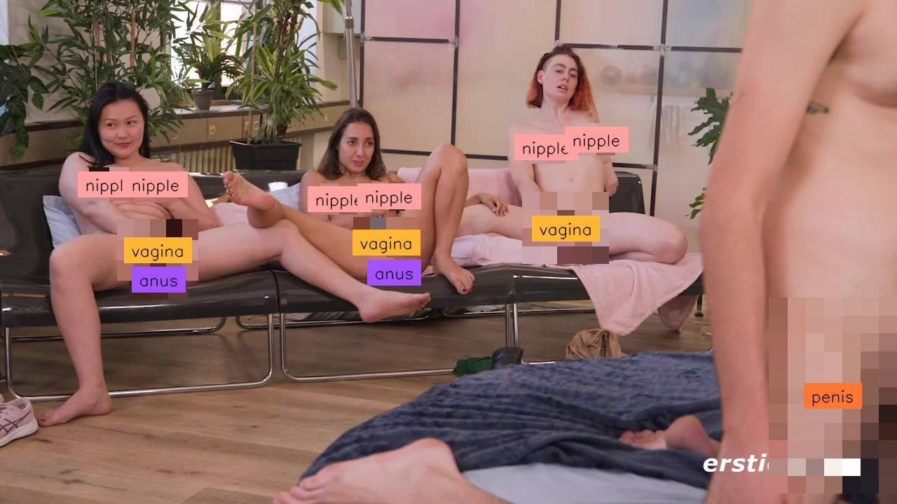
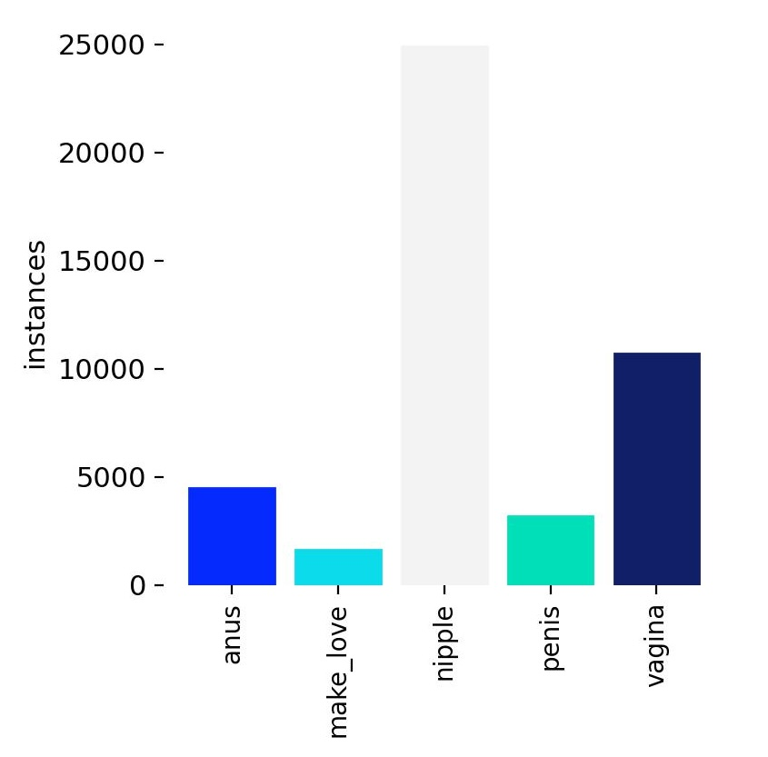
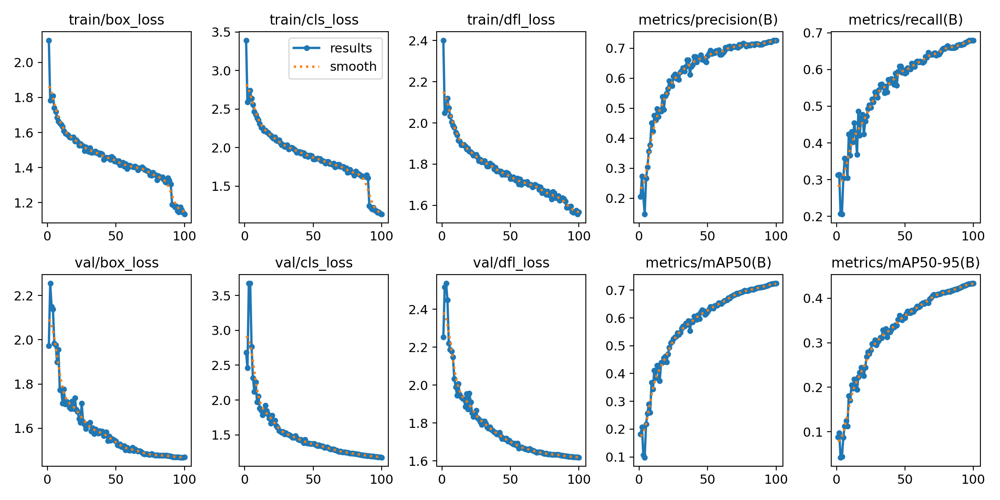
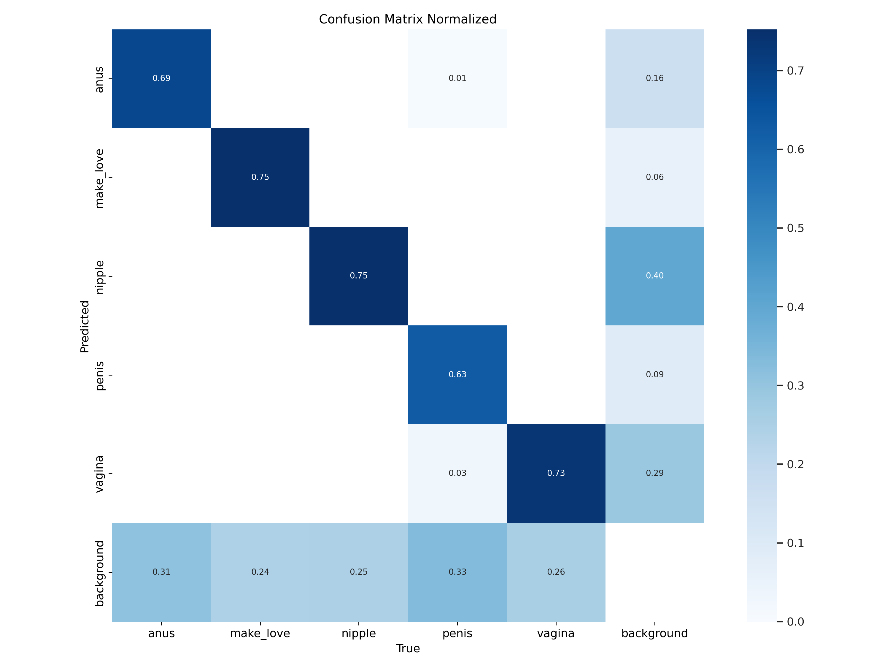
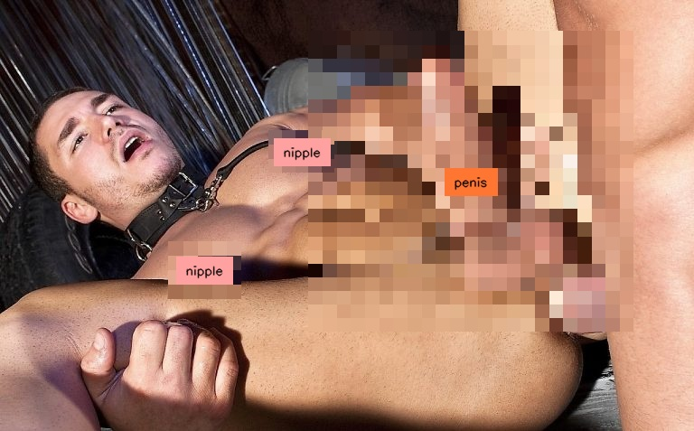
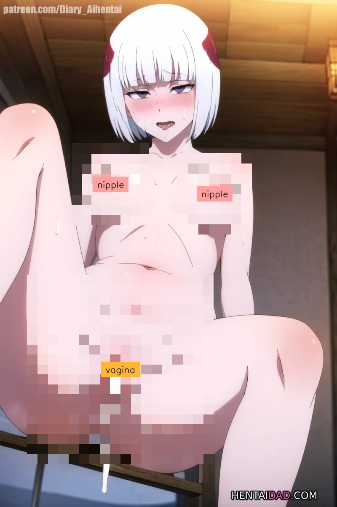
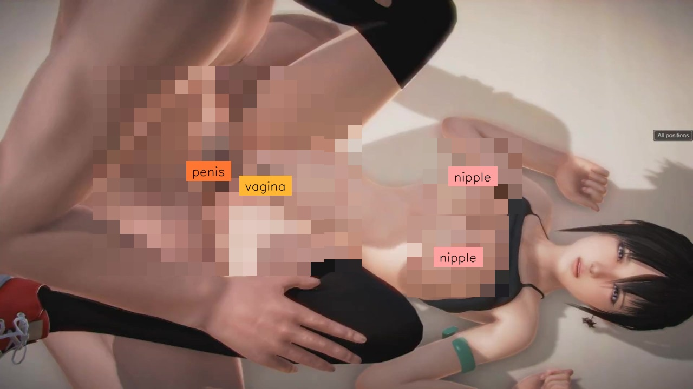
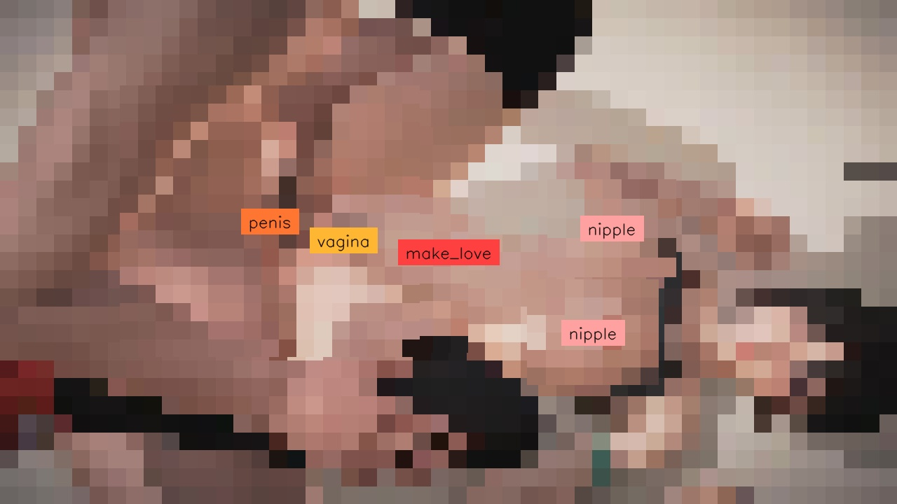
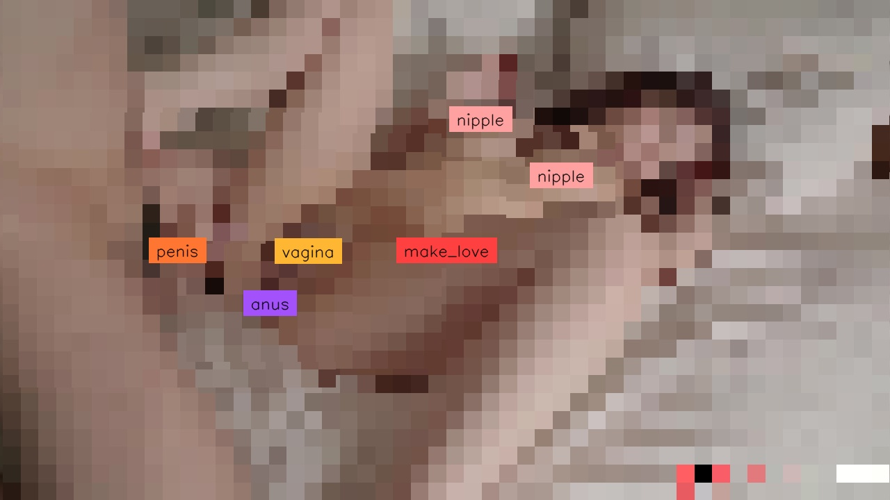
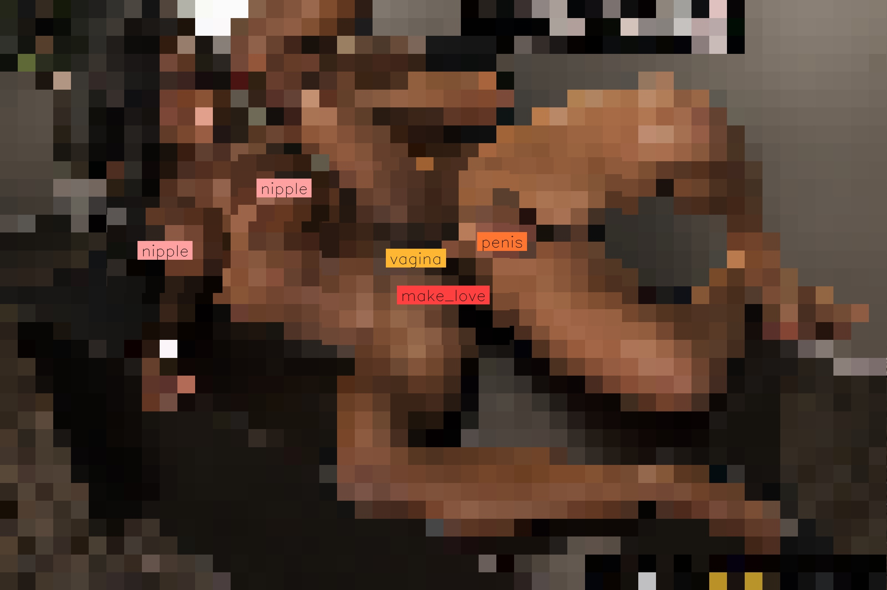

<p align="center">
  
</p>

<h1 style="color:red" style="text-align:center;"> 
  🔞 WARNING: SENSITIVE CONTENT 🔞 
</h1>

<h2>
  THIS MEDIA CONTAINS SENSITIVE CONTENT (I.E. NUDITY, VIOLENCE, PROFANITY, PORN) THAT SOME PEOPLE MAY FIND OFFENSIVE. YOU MUST BE 18 OR OLDER TO VIEW THIS CONTENT.
</h2>

----------
# EraX-NSFW-V1.0
A Highly Efficient Model for NSFW Detection. Very effective for **pre-publication image and video control**, or for **limiting children's access to harmful publications**.
You can either just predict the classes and their boundingboxes or even mask the predicted harmful object(s) or mask the entire image. 
Please see the deployment codes below.

- **Developed by**:
  - Phạm Đình Thục (thuc.pd@erax.ai)
  - Mr. Nguyễn Anh Nguyên (nguyen@erax.ai)
- **Model version**: v1.0
- **License**: Apache 2.0

<!-- ## Examples
 -->

## Model Details / Overview

- **Model Architecture**: YOLO11 (nano, small, medium)
- **Task**: Object Detection (NSFW Detection)
- **Dataset**: Private datasets (from Internet).
- **Training set**: 31890 images.
- **Validation set**: 11538 images.
- **Classes**: anus, make_love, nipple, penis, vagina.

### Labels


## Training Configuration
- **Model Weights Files**:
  - Nano: [`erax_nsfw_yolo11n.pt`](./erax_nsfw_yolo11n.pt) 
  - Small: [`erax_nsfw_yolo11s.pt`](./erax_nsfw_yolo11s.pt)
  - Medium: [`erax_nsfw_yolo11m.pt`](./erax_nsfw_yolo11m.pt)
- **Number of Epochs**: 100
- **Learning Rate**: 0.01
- **Batch Size**: 208
- **Image Size**: 640x640
- **Training server**: 8 x NVIDIA RTX A4000 (16GB GDDR6)
- **Training time**: ~10 hours


## Evaluation Metrics
Below are the key metrics from the model evaluation on the validation set:
comming soon
<!-- 
- **Precision**: 0.726
- **Recall**: 0.68
- **mAP50**: 0.724
- **mAP50-95**: 0.434 -->

<!-- | Format                 | Status |  Size (MB) |  metrics/mAP50-95(B)  |  Inference time (ms/im) |   FPS   |
|:-----------------------|:-------|:-----------|:----------------------|:------------------------|:--------|
|  PyTorch               |   ✅   |    38.6    |         0.4332        |          16.97          |  58.91  |
|TorchScript             |	 ✅	  |    77	   |         0.4153	       |          12.09      	 |  82.69  |
|   ONNX                 |   ✅	  |    76.7	   |         0.4153	       |          103.94      	 |  9.62   |
| OpenVINO               |	 ❌	  |    -	   |         -  	       |          -         	 |  -      |
| TensorRT               | 	 ✅	  |    89.6	   |         0.4155	       |          7          	 |  142.92 |
| CoreML                 |	 ❌	  |    -	   |         -  	       |          -         	 |  -      |
| TensorFlow SavedModel  | 	 ✅	  |    192.3   |         0.4153	       |          40.19        	 |  24.88  |
| TensorFlow GraphDef    |	 ✅	  |    76.8	   |         0.4153	       |          36.71        	 |  27.24  |
| TensorFlow Lite        |	 ❌	  |    -	   |         -  	       |          -         	 |  -      |
| TensorFlow Edge TPU    |	 ❌	  |    -	   |         -  	       |          -         	 |  -      |
| TensorFlow.js          |	 ❌	  |    -	   |         -  	       |          -         	 |  -      |
| PaddlePaddle           | 	 ✅	  |    153.3   |         0.4153	       |          1024.24      	 |  0.98   |
| NCNN                   |	 ✅   |    76.6	   |         0.4153	       |          187.36       	 |  5.34   | -->


<!-- <table>
    <thead>
        <tr>
            <th>Format</th>
            <th width="200">Model</th>
            <th width="100">Size (MB)</th>
            <th>metrics/mAP50-95(B)</th>
            <th>Inference time (ms/im)</th>
            <th width="100">FPS</th>
        </tr>
    </thead>
    <tbody>
        <tr>
            <th rowspan=3>PyTorch</th>
            <th>erax_nsfw_yolo11n.pt</th>
            <th>5.20</th>
            <th>0.3563</th>
            <th>160.17</th>
            <th>6</th>
        </tr>
        <tr>
            <th>erax_nsfw_yolo11s.pt</th>
            <th>18.30</th>
            <th>0.4083</th>
            <th>10.12</th>
            <th>99</th>
        </tr>
        <tr>
            <th>erax_nsfw_yolo11m.pt</th>
            <th>38.60</th>
            <th>0.4332</th>
            <th>12.04</th>
            <th>83</th>
        </tr>
        <tr>
            <th rowspan=3>TorchScript</th>
            <th>erax_nsfw_yolo11n.pt</th>
            <th>10.40</th>
            <th>0.3427</th>
            <th>75.11</th>
            <th>13</th>
        </tr>
        <tr>
            <th>erax_nsfw_yolo11s.pt</th>
            <th>36.40</th>
            <th>0.3918</th>
            <th>4.40</th>
            <th>227</th>
        </tr>
        <tr>
            <th>erax_nsfw_yolo11m.pt</th>
            <th>77.00</th>
            <th>0.4153</th>
            <th>6.32</th>
            <th>158</th>
        </tr>
      <tr>
            <th rowspan=3>ONNX</th>
            <th>erax_nsfw_yolo11n.pt</th>
            <th>10.10</th>
            <th>0.3427</th>
            <th>154.94</th>
            <th>6</th>
        </tr>
        <tr>
            <th>erax_nsfw_yolo11s.pt</th>
            <th>36.20</th>
            <th>0.3918</th>
            <th>9.82</th>
            <th>102</th>
        </tr>
        <tr>
            <th>erax_nsfw_yolo11m.pt</th>
            <th>76.70</th>
            <th>0.4153</th>
            <th>16.38</th>
            <th>61</th>
        </tr>
      <tr>
            <th rowspan=3>TensorRT</th>
            <th>erax_nsfw_yolo11n.pt</th>
            <th>15.60</th>
            <th>0.3426</th>
            <th>6.25</th>
            <th>160</th>
        </tr>
        <tr>
            <th>erax_nsfw_yolo11s.pt</th>
            <th>47.30</th>
            <th>0.3918</th>
            <th>2.62</th>
            <th>381</th>
        </tr>
        <tr>
            <th>erax_nsfw_yolo11m.pt</th>
            <th>92.70</th>
            <th>0.4154</th>
            <th>4.94</th>
            <th>202</th>
        </tr>
      <tr>
            <th rowspan=3>TensorFlow SavedModel</th>
            <th>erax_nsfw_yolo11n.pt</th>
            <th>25.90</th>
            <th>0.3427</th>
            <th>27.35</th>
            <th>37</th>
        </tr>
        <tr>
            <th>erax_nsfw_yolo11s.pt</th>
            <th>93.30</th>
            <th>0.3918</th>
            <th>33.82</th>
            <th>30</th>
        </tr>
        <tr>
            <th>erax_nsfw_yolo11m.pt</th>
            <th>193.40</th>
            <th>0.4153</th>
            <th>34.29</th>
            <th>29</th>
        </tr>
      <tr>
            <th rowspan=3>TensorFlow GraphDef</th>
            <th>erax_nsfw_yolo11n.pt</th>
            <th>10.20</th>
            <th>0.3427</th>
            <th>26.58</th>
            <th>38</th>
        </tr>
        <tr>
            <th>erax_nsfw_yolo11s.pt</th>
            <th>36.30</th>
            <th>0.3918</th>
            <th>31.84</th>
            <th>31</th>
        </tr>
        <tr>
            <th>erax_nsfw_yolo11m.pt</th>
            <th>76.80</th>
            <th>0.4153</th>
            <th>31.83</th>
            <th>31</th>
        </tr>
      <tr>
            <th rowspan=3>PaddlePaddle</th>
            <th>erax_nsfw_yolo11n.pt</th>
            <th>20.10</th>
            <th>0.3427</th>
            <th>264.66</th>
            <th>4</th>
        </tr>
        <tr>
            <th>erax_nsfw_yolo11s.pt</th>
            <th>72.30</th>
            <th>0.3918</th>
            <th>453.69</th>
            <th>2</th>
        </tr>
        <tr>
            <th>erax_nsfw_yolo11m.pt</th>
            <th>153.30</th>
            <th>0.4153</th>
            <th>2519.82</th>
            <th>0</th>
        </tr>
    </tbody>
  <tr>
            <th rowspan=3>NCNN</th>
            <th>erax_nsfw_yolo11n.pt</th>
            <th>10.00</th>
            <th>0.3427</th>
            <th>893.43</th>
            <th>1</th>
        </tr>
        <tr>
            <th>erax_nsfw_yolo11s.pt</th>
            <th>36.10</th>
            <th>0.3918</th>
            <th>1418.91</th>
            <th>1</th>
        </tr>
        <tr>
            <th>erax_nsfw_yolo11m.pt</th>
            <th>76.60</th>
            <th>0.4153</th>
            <th>2647.62</th>
            <th>0</th>
        </tr>
</table>
 -->

## Training Validation Results
### Training and Validation Losses


### Confusion Matrix



## Inference

To use the trained model, follow these steps:

1. **Install the necessary packages**:
```curl
pip install ultralytics supervision huggingface-hub
```

2. **Download Pretrained model**:
```python
from huggingface_hub import snapshot_download
snapshot_download(repo_id="erax-ai/EraX-NSFW-V1.0", local_dir="./", force_download=True)
``` 

3. **Simple Use Case**:
```python
from ultralytics import YOLO
from PIL import Image
import supervision as sv
import numpy as np

IOU_THRESHOLD        = 0.3
CONFIDENCE_THRESHOLD = 0.2

# pretrained_path = "erax_nsfw_yolo11n.pt"
# pretrained_path = "erax_nsfw_yolo11s.pt"
pretrained_path = "erax_nsfw_yolo11m.pt"

image_path_list = ["test_images/img_1.jpg", "test_images/img_2.jpg"]

model = YOLO(pretrained_path)
results = model(image_path_list,
                  conf=CONFIDENCE_THRESHOLD,
                  iou=IOU_THRESHOLD
                )


for result in results:
    annotated_image = result.orig_img.copy()
    h, w = annotated_image.shape[:2]
    anchor = h if h > w else w

    detections = sv.Detections.from_ultralytics(result)
    label_annotator = sv.LabelAnnotator(text_color=sv.Color.BLACK,
                                        text_position=sv.Position.CENTER,
                                        text_scale=anchor/1700)
    
    pixelate_annotator = sv.PixelateAnnotator(pixel_size=anchor/50)
    
    annotated_image = pixelate_annotator.annotate(
        scene=annotated_image.copy(),
        detections=detections
    )


    annotated_image = label_annotator.annotate(
        annotated_image,
        detections=detections
    )

    
    sv.plot_image(annotated_image, size=(10, 10))
```

## Training
Scripts for training: https://github.com/EraX-JS-Company/EraX-NSFW-V1.0

## More examples

1. **Example 01**:



2. **Example 02**:



3. **Example 03**: SAFEEST for using make_love class as it will cover entire context.
Without make_love class    |  With make_love class
:-------------------------:|:-------------------------:
  |  
  |  
  |  


## Citation 
If you find our project useful, we would appreciate it if you could star our repository and cite our work as follows:
```bibtex
@article{EraX-NSFW-V1.0,
  author    = {Phạm Đình Thục and
              Mr. Nguyễn Anh Nguyên and
              Đoàn Thành Khang and
              Mr. Trần Hải Khương and
              Mr. Trương Công Đức and 
              Phan Nguyễn Tuấn Kha and 
              Phạm Huỳnh Nhật},
  title     = {EraX-NSFW-V1.0: A Highly Efficient Model for NSFW Detection},
  organization={EraX JS Company},
  year={2024},
  url={https://huggingface.co/erax-ai/EraX-NSFW-V1.0}
}
```